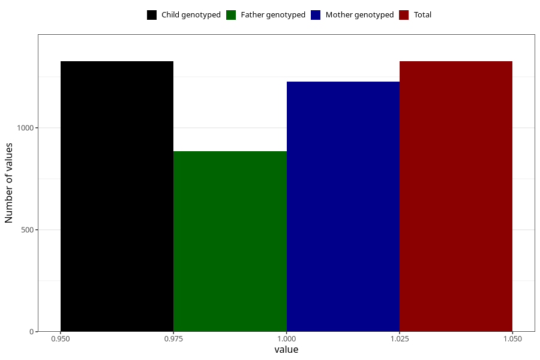

# impaired_hearing_previous_3y
Variable mapping to `GG31` in `Skjema6_3aar_v12`.
- Number of values:

| Value | Total | Child genotyped | Mother genotyped | Father genotyped |
| ----- | ----- | --------------- | ---------------- | ---------------- |
| Missing | 79679 | 79679 | 75390 | 52718 |
| Non-missing | 1326 | 1326 | 1227 | 886 |
| 1 | 1326 | 1326 | 1227 | 886 |

