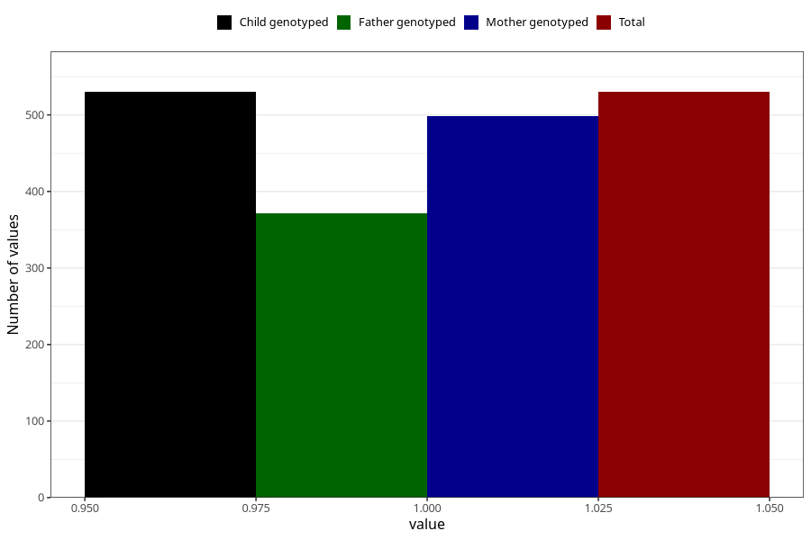

# impaired_hearing_previously_18m
Variable mapping to `EE793` in `Skjema5_18mnd_v12`.
- Number of values:

| Value | Total | Child genotyped | Mother genotyped | Father genotyped |
| ----- | ----- | --------------- | ---------------- | ---------------- |
| Missing | 80475 | 80475 | 76118 | 53232 |
| Non-missing | 530 | 530 | 499 | 372 |
| 1 | 530 | 530 | 499 | 372 |

