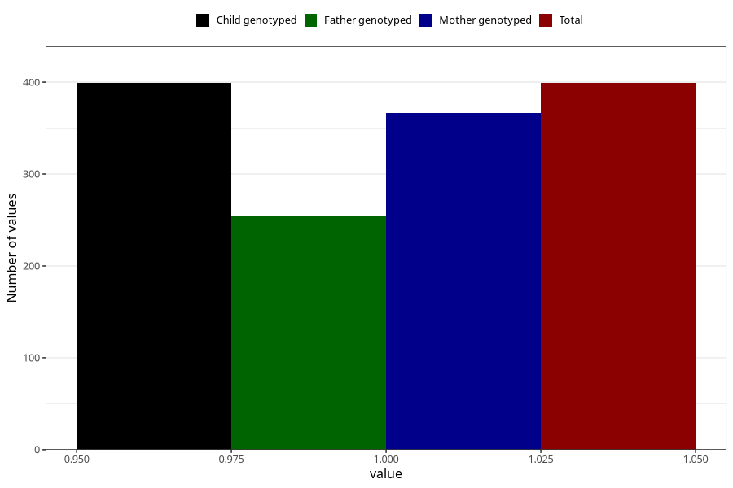

# impaired_hearing_yes_18m
Variable mapping to `EE792` in `Skjema5_18mnd_v12`.
- Number of values:

| Value | Total | Child genotyped | Mother genotyped | Father genotyped |
| ----- | ----- | --------------- | ---------------- | ---------------- |
| Missing | 80606 | 80606 | 76251 | 53349 |
| Non-missing | 399 | 399 | 366 | 255 |
| 1 | 399 | 399 | 366 | 255 |

