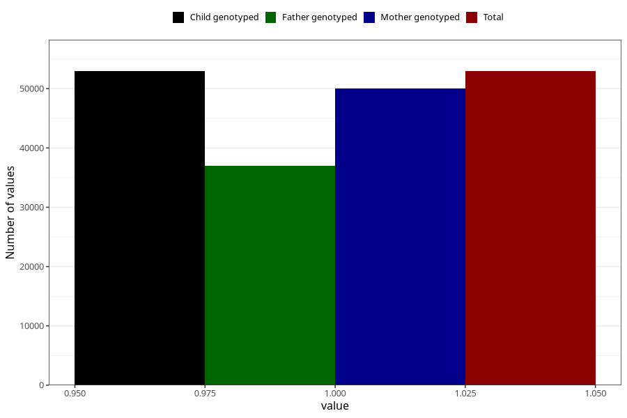

# impaired_vision_no_18m
Variable mapping to `EE795` in `Skjema5_18mnd_v12`.
- Number of values:

| Value | Total | Child genotyped | Mother genotyped | Father genotyped |
| ----- | ----- | --------------- | ---------------- | ---------------- |
| Missing | 28061 | 28061 | 26534 | 16645 |
| Non-missing | 52944 | 52944 | 50083 | 36959 |
| 1 | 52944 | 52944 | 50083 | 36959 |

