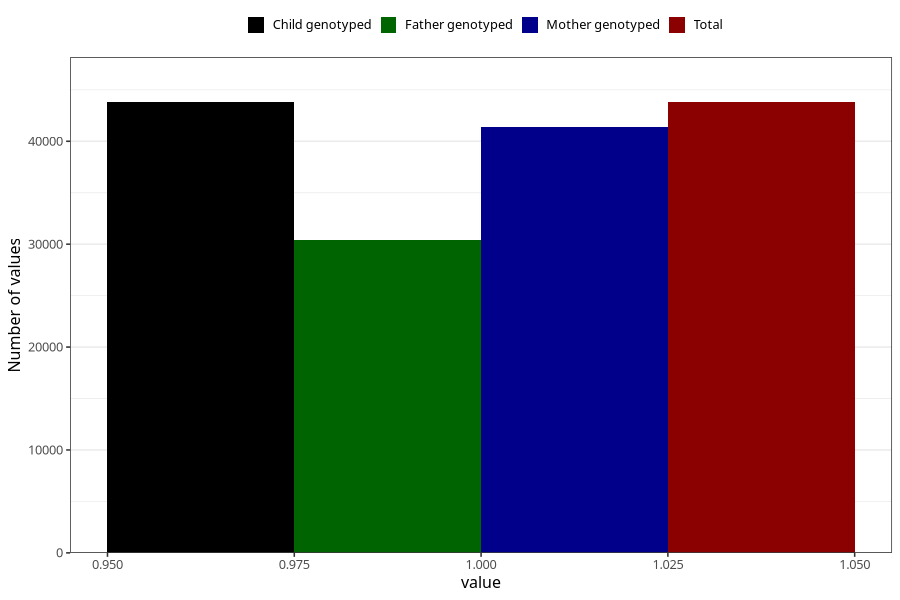

# impaired_vision_no_3y
Variable mapping to `GG33` in `Skjema6_3aar_v12`.
- Number of values:

| Value | Total | Child genotyped | Mother genotyped | Father genotyped |
| ----- | ----- | --------------- | ---------------- | ---------------- |
| Missing | 37208 | 37208 | 35194 | 23204 |
| Non-missing | 43797 | 43797 | 41423 | 30400 |
| 1 | 43797 | 43797 | 41423 | 30400 |

