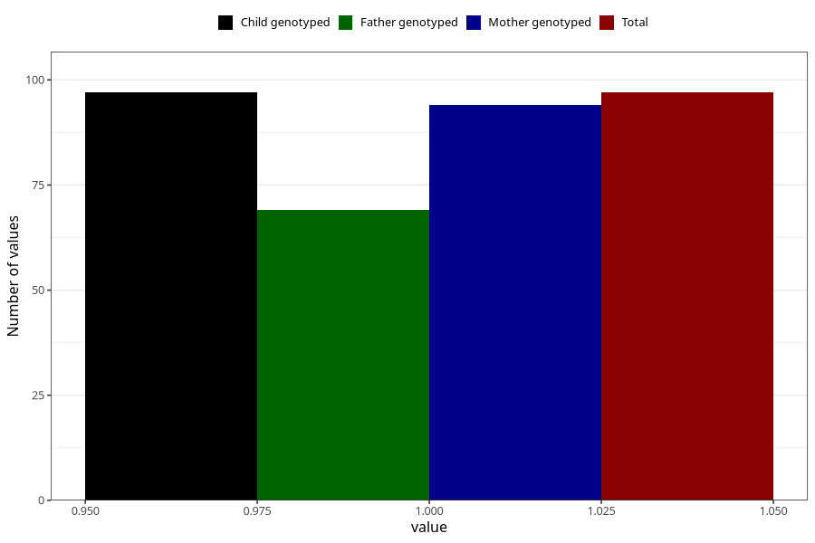

# impaired_vision_previous_3y
Variable mapping to `GG35` in `Skjema6_3aar_v12`.
- Number of values:

| Value | Total | Child genotyped | Mother genotyped | Father genotyped |
| ----- | ----- | --------------- | ---------------- | ---------------- |
| Missing | 80908 | 80908 | 76523 | 53535 |
| Non-missing | 97 | 97 | 94 | 69 |
| 1 | 97 | 97 | 94 | 69 |

