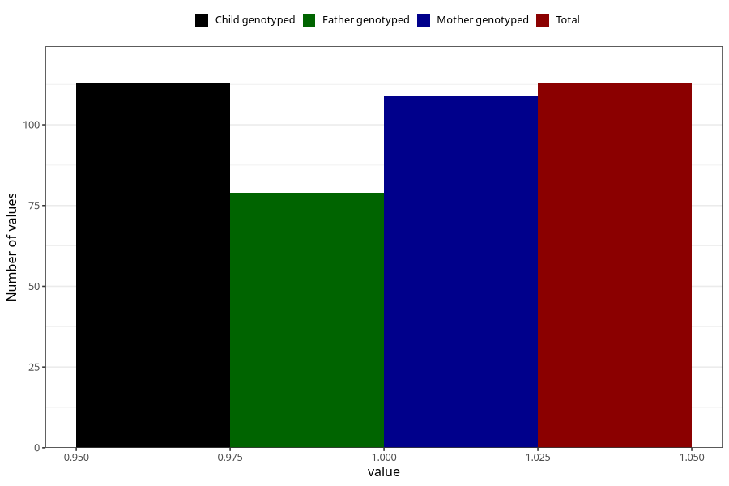

# impaired_vision_previously_18m
Variable mapping to `EE797` in `Skjema5_18mnd_v12`.
- Number of values:

| Value | Total | Child genotyped | Mother genotyped | Father genotyped |
| ----- | ----- | --------------- | ---------------- | ---------------- |
| Missing | 80892 | 80892 | 76508 | 53525 |
| Non-missing | 113 | 113 | 109 | 79 |
| 1 | 113 | 113 | 109 | 79 |

