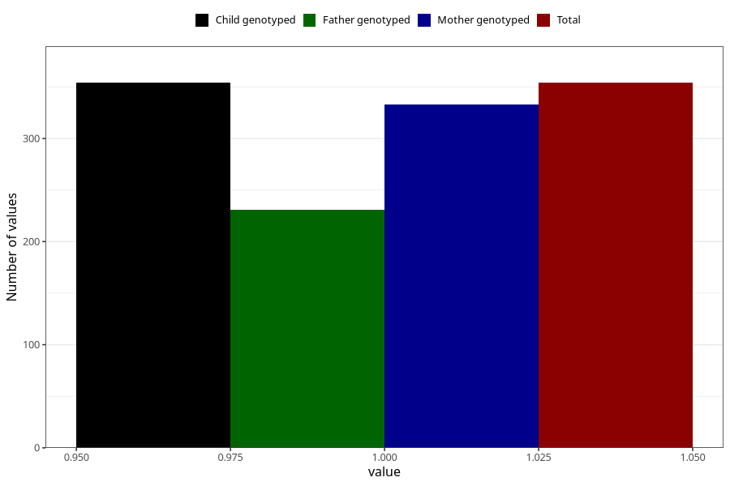

# impaired_vision_yes_18m
Variable mapping to `EE796` in `Skjema5_18mnd_v12`.
- Number of values:

| Value | Total | Child genotyped | Mother genotyped | Father genotyped |
| ----- | ----- | --------------- | ---------------- | ---------------- |
| Missing | 80651 | 80651 | 76284 | 53373 |
| Non-missing | 354 | 354 | 333 | 231 |
| 1 | 354 | 354 | 333 | 231 |

