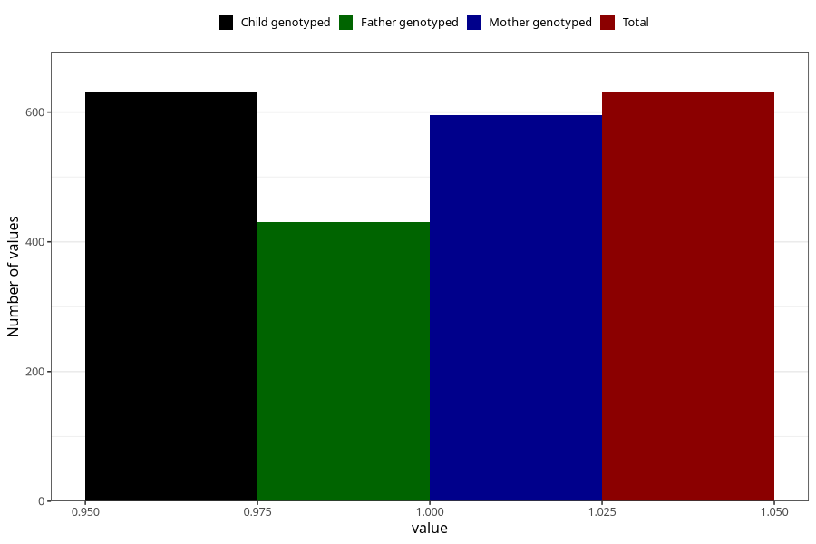

# impaired_vision_yes_3y
Variable mapping to `GG34` in `Skjema6_3aar_v12`.
- Number of values:

| Value | Total | Child genotyped | Mother genotyped | Father genotyped |
| ----- | ----- | --------------- | ---------------- | ---------------- |
| Missing | 80375 | 80375 | 76022 | 53173 |
| Non-missing | 630 | 630 | 595 | 431 |
| 1 | 630 | 630 | 595 | 431 |

