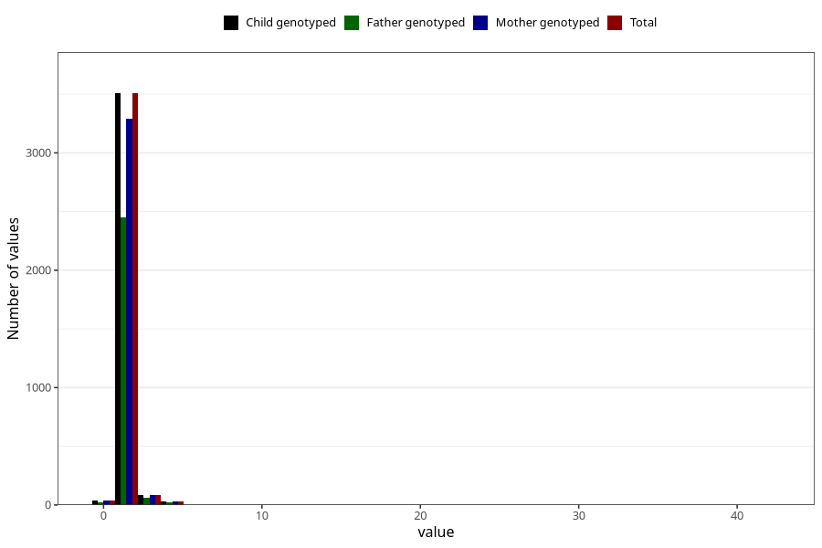

# injury_or_accident_freq_3y
Variable mapping to `GG165` in `Skjema6_3aar_v12`.
- Number of values:

| Value | Total | Child genotyped | Mother genotyped | Father genotyped |
| ----- | ----- | --------------- | ---------------- | ---------------- |
| Missing | 77338 | 77338 | 73174 | 51042 |
| Non-missing | 3667 | 3667 | 3443 | 2562 |
| 0 | 37 | 37 | 35 | 25 |
| 1 | 2974 | 2974 | 2791 | 2080 |
| 2 | 533 | 533 | 502 | 373 |
| 3 | 88 | 88 | 81 | 64 |
| 4 | 18 | 18 | 18 | 13 |
| 5 | 12 | 12 | 11 | 7 |
| 7 | 1 | 1 | 1 | 0 |
| 8 | 1 | 1 | 1 | 0 |
| 10 | 1 | 1 | 1 | 0 |
| 35 | 1 | 1 | 1 | 0 |
| 42 | 1 | 1 | 1 | 0 |

