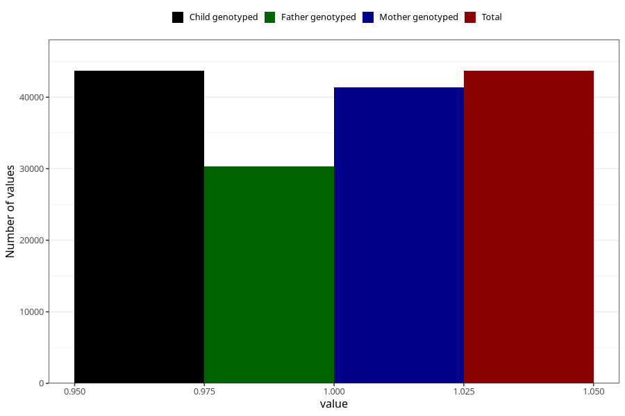

# joint_problems_no_3y
Variable mapping to `GG45` in `Skjema6_3aar_v12`.
- Number of values:

| Value | Total | Child genotyped | Mother genotyped | Father genotyped |
| ----- | ----- | --------------- | ---------------- | ---------------- |
| Missing | 37320 | 37320 | 35285 | 23267 |
| Non-missing | 43685 | 43685 | 41332 | 30337 |
| 1 | 43685 | 43685 | 41332 | 30337 |

