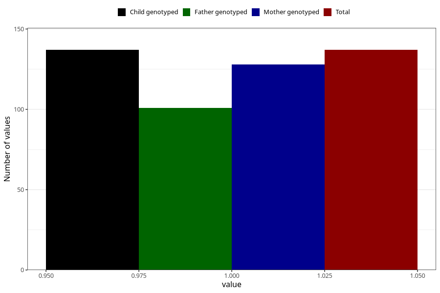

# joint_problems_yes_3y
Variable mapping to `GG46` in `Skjema6_3aar_v12`.
- Number of values:

| Value | Total | Child genotyped | Mother genotyped | Father genotyped |
| ----- | ----- | --------------- | ---------------- | ---------------- |
| Missing | 80868 | 80868 | 76489 | 53503 |
| Non-missing | 137 | 137 | 128 | 101 |
| 1 | 137 | 137 | 128 | 101 |

