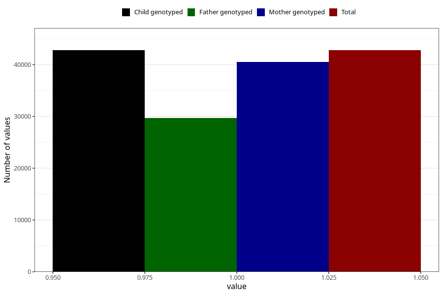

# late_or_abnormal_speech_development_no_3y
Variable mapping to `GG93` in `Skjema6_3aar_v12`.
- Number of values:

| Value | Total | Child genotyped | Mother genotyped | Father genotyped |
| ----- | ----- | --------------- | ---------------- | ---------------- |
| Missing | 38231 | 38231 | 36132 | 23867 |
| Non-missing | 42774 | 42774 | 40485 | 29737 |
| 1 | 42774 | 42774 | 40485 | 29737 |

