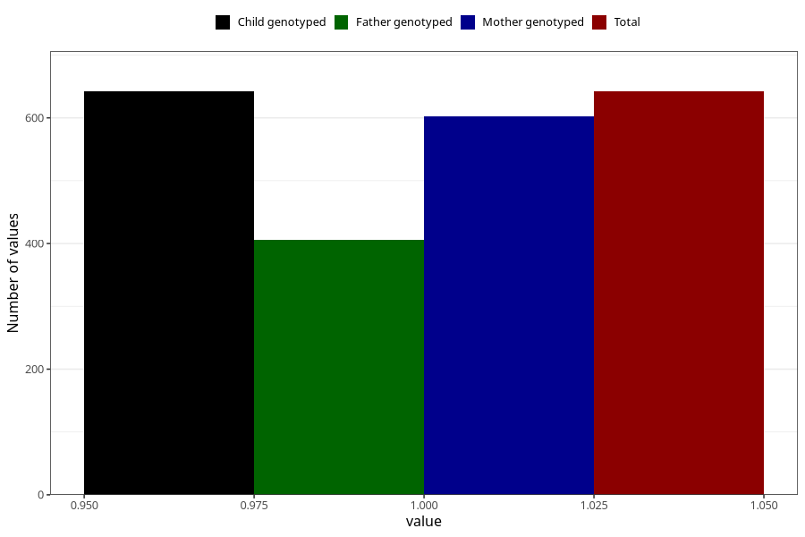

# late_or_abnormal_speech_development_previous_3y
Variable mapping to `GG95` in `Skjema6_3aar_v12`.
- Number of values:

| Value | Total | Child genotyped | Mother genotyped | Father genotyped |
| ----- | ----- | --------------- | ---------------- | ---------------- |
| Missing | 80363 | 80363 | 76015 | 53198 |
| Non-missing | 642 | 642 | 602 | 406 |
| 1 | 642 | 642 | 602 | 406 |

