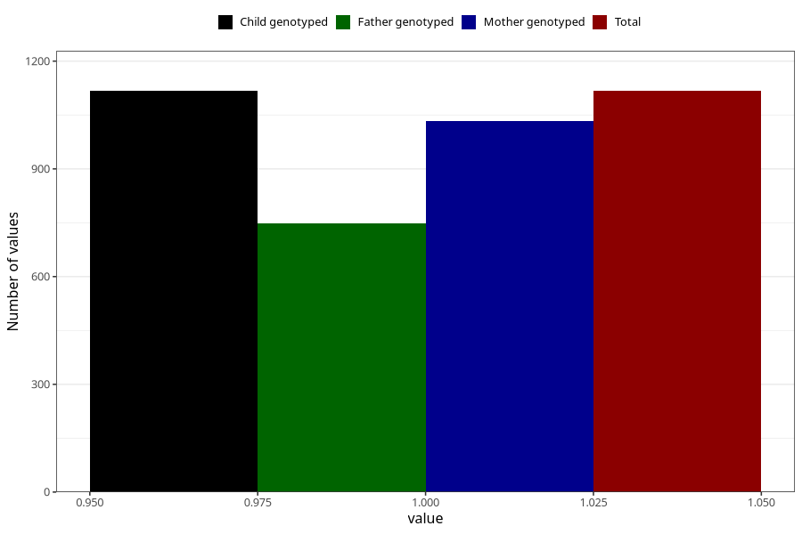

# late_or_abnormal_speech_development_yes_3y
Variable mapping to `GG94` in `Skjema6_3aar_v12`.
- Number of values:

| Value | Total | Child genotyped | Mother genotyped | Father genotyped |
| ----- | ----- | --------------- | ---------------- | ---------------- |
| Missing | 79888 | 79888 | 75585 | 52856 |
| Non-missing | 1117 | 1117 | 1032 | 748 |
| 1 | 1117 | 1117 | 1032 | 748 |

