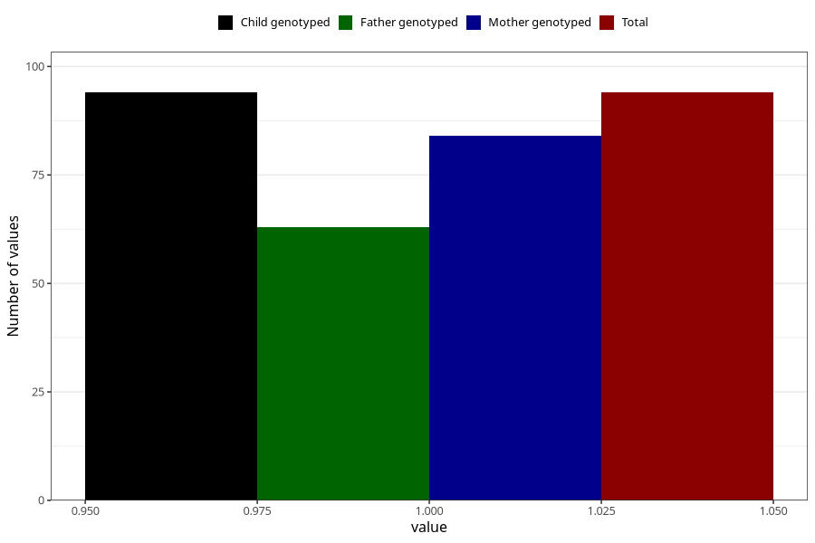

# mental_retardation_7y
Variable mapping to `JJ435` in `Skjema7aar_v12`.
- Number of values:

| Value | Total | Child genotyped | Mother genotyped | Father genotyped |
| ----- | ----- | --------------- | ---------------- | ---------------- |
| Missing | 80911 | 80911 | 76533 | 53541 |
| Non-missing | 94 | 94 | 84 | 63 |
| 1 | 94 | 94 | 84 | 63 |

