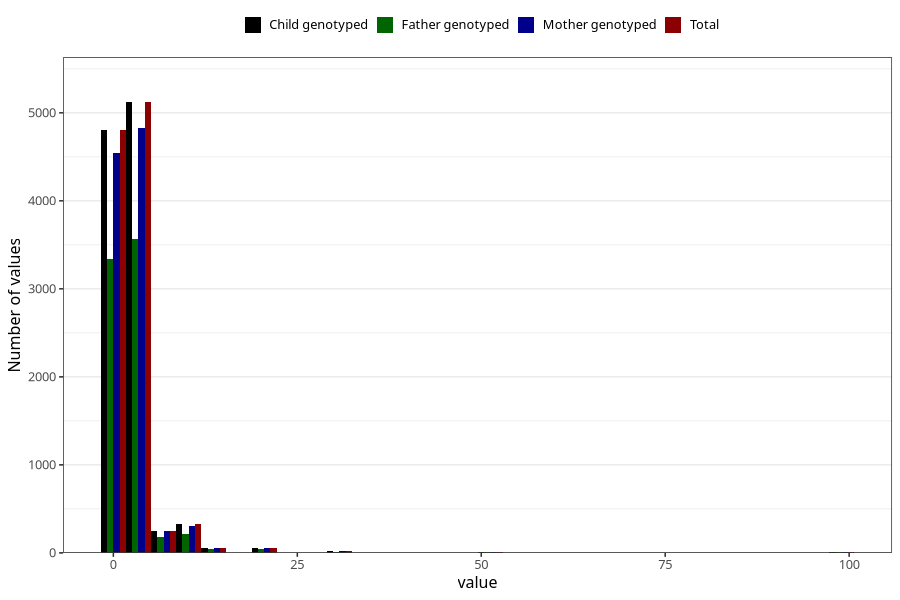

# nappy_rash_freq_6m
Variable mapping to `DD308` in `Skjema4_6mnd_v12`.
- Number of values:

| Value | Total | Child genotyped | Mother genotyped | Father genotyped |
| ----- | ----- | --------------- | ---------------- | ---------------- |
| Missing | 70333 | 70333 | 66525 | 46191 |
| Non-missing | 10672 | 10672 | 10092 | 7413 |
| 25th percentile | 1 | 1 | 1 | 1 |
| 50th percentile | 2 | 2 | 2 | 2 |
| 75th percentile | 3 | 3 | 3 | 3 |
| Mean | 2.69836956521739 | 2.69836956521739 | 2.71472453428458 | 2.67044381491974 |
| Standard deviation | 4.55289976018156 | 4.55289976018156 | 4.64681332093938 | 4.39720226757364 |
| N | 10672 | 10672 | 10092 | 7413 |

