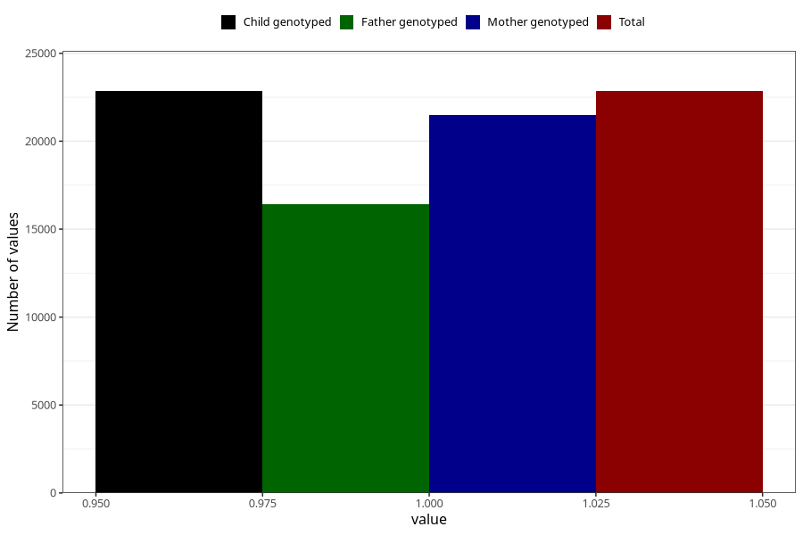

# no_syndrome_or_chromosomal_defect_6m
Variable mapping to `DD1109` in `Skjema4_6mnd_v12`.
- Number of values:

| Value | Total | Child genotyped | Mother genotyped | Father genotyped |
| ----- | ----- | --------------- | ---------------- | ---------------- |
| Missing | 58157 | 58157 | 55112 | 37162 |
| Non-missing | 22848 | 22848 | 21505 | 16442 |
| 1 | 22848 | 22848 | 21505 | 16442 |

