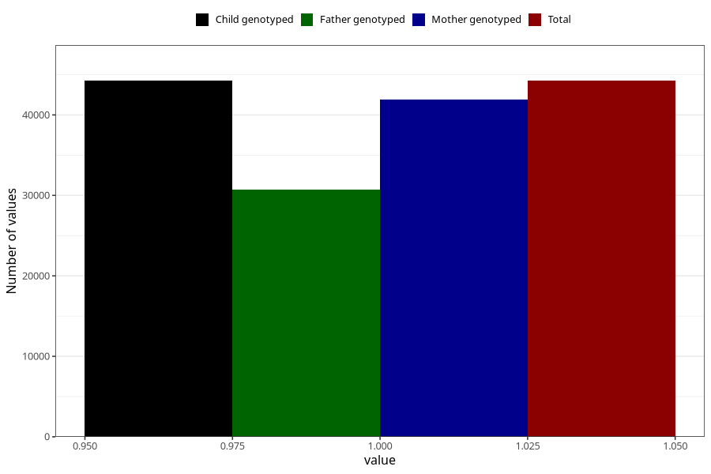

# other_behavioral_problems_no_3y
Variable mapping to `GG109` in `Skjema6_3aar_v12`.
- Number of values:

| Value | Total | Child genotyped | Mother genotyped | Father genotyped |
| ----- | ----- | --------------- | ---------------- | ---------------- |
| Missing | 36757 | 36757 | 34753 | 22875 |
| Non-missing | 44248 | 44248 | 41864 | 30729 |
| 1 | 44248 | 44248 | 41864 | 30729 |

