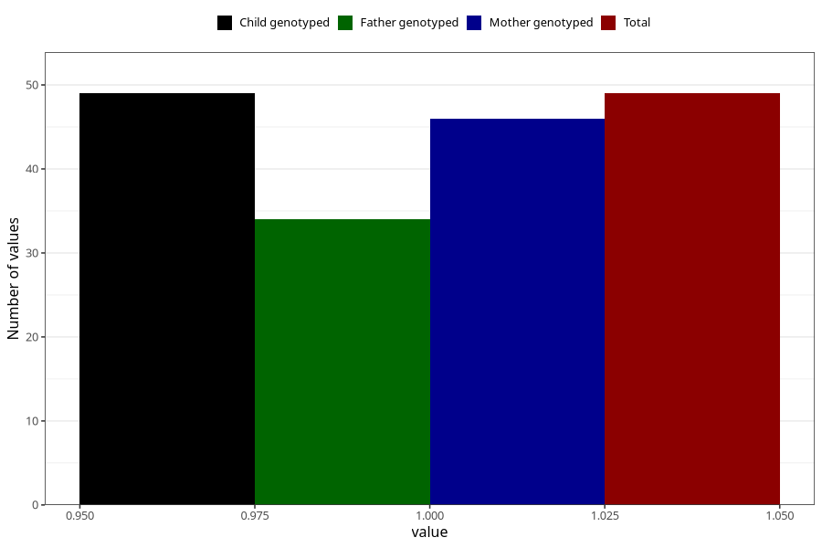

# other_behavioral_problems_previous_3y
Variable mapping to `GG111` in `Skjema6_3aar_v12`.
- Number of values:

| Value | Total | Child genotyped | Mother genotyped | Father genotyped |
| ----- | ----- | --------------- | ---------------- | ---------------- |
| Missing | 80956 | 80956 | 76571 | 53570 |
| Non-missing | 49 | 49 | 46 | 34 |
| 1 | 49 | 49 | 46 | 34 |

