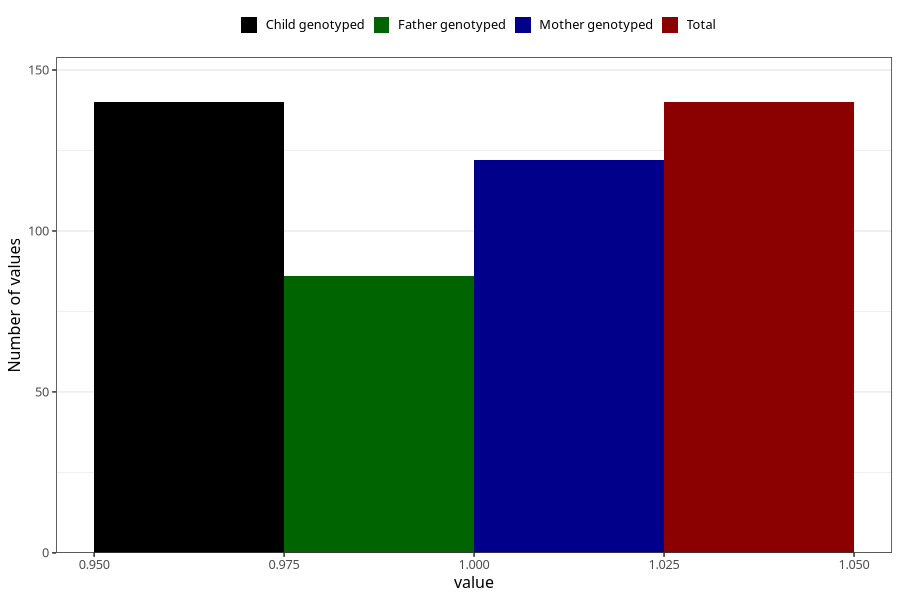

# other_behavioral_problems_yes_3y
Variable mapping to `GG110` in `Skjema6_3aar_v12`.
- Number of values:

| Value | Total | Child genotyped | Mother genotyped | Father genotyped |
| ----- | ----- | --------------- | ---------------- | ---------------- |
| Missing | 80865 | 80865 | 76495 | 53518 |
| Non-missing | 140 | 140 | 122 | 86 |
| 1 | 140 | 140 | 122 | 86 |

