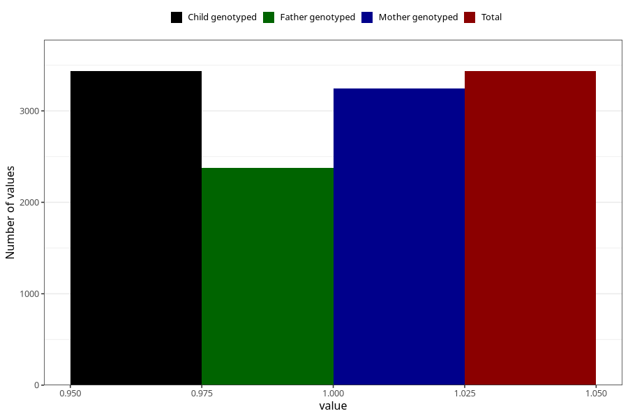

# other_conditions_congenital_syndroms_7y
Variable mapping to `JJ441` in `Skjema7aar_v12`.
- Number of values:

| Value | Total | Child genotyped | Mother genotyped | Father genotyped |
| ----- | ----- | --------------- | ---------------- | ---------------- |
| Missing | 77571 | 77571 | 73373 | 51229 |
| Non-missing | 3434 | 3434 | 3244 | 2375 |
| 1 | 3434 | 3434 | 3244 | 2375 |

