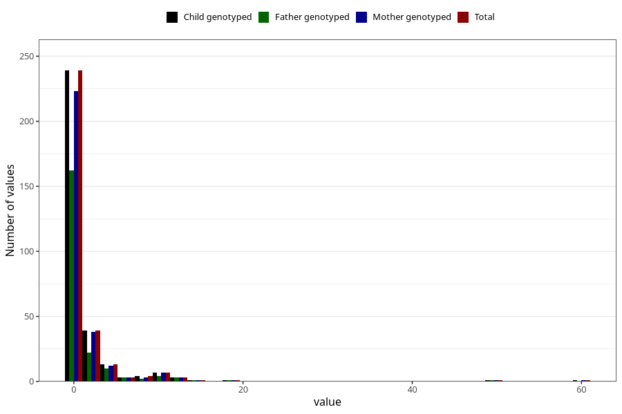

# other_convulsions_no_fever_number_12_18m
Variable mapping to `EE263` in `Skjema5_18mnd_v12`.
- Number of values:

| Value | Total | Child genotyped | Mother genotyped | Father genotyped |
| ----- | ----- | --------------- | ---------------- | ---------------- |
| Missing | 80691 | 80691 | 76322 | 53394 |
| Non-missing | 314 | 314 | 295 | 210 |
| Filled in text or mark instead of number | 2 | 2 | 2 |1 |
| 0 | 170 | 170 | 159 | 114 |
| 1 | 69 | 69 | 64 | 48 |
| 2 | 28 | 28 | 28 | 15 |
| 3 | 11 | 11 | 10 | 7 |
| 4 | 7 | 7 | 6 | 4 |
| 5 | 6 | 6 | 6 | 6 |
| 6 | 2 | 2 | 2 | 2 |
| 7 | 1 | 1 | 1 | 1 |
| 8 | 3 | 3 | 3 | 2 |
| 9 | 1 | 1 | 0 | 0 |
| 10 | 6 | 6 | 6 | 4 |
| 11 | 1 | 1 | 1 | 0 |
| 12 | 3 | 3 | 3 | 3 |
| 15 | 1 | 1 | 1 | 1 |
| 18 | 1 | 1 | 1 | 1 |
| 50 | 1 | 1 | 1 | 1 |
| 60 | 1 | 1 | 1 | 0 |

