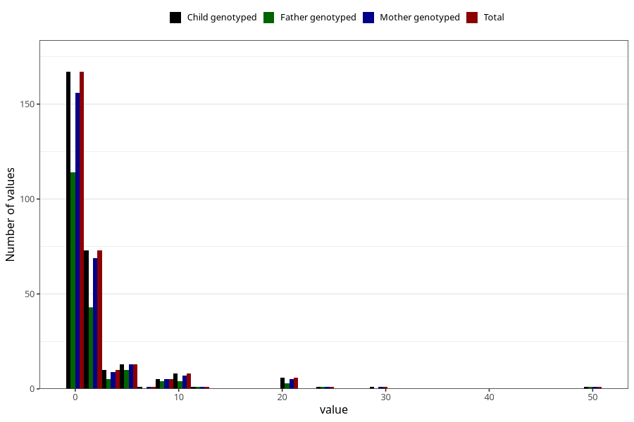

# other_convulsions_no_fever_number_6_11m
Variable mapping to `EE261` in `Skjema5_18mnd_v12`.
- Number of values:

| Value | Total | Child genotyped | Mother genotyped | Father genotyped |
| ----- | ----- | --------------- | ---------------- | ---------------- |
| Missing | 80716 | 80716 | 76346 | 53417 |
| Non-missing | 289 | 289 | 271 | 187 |
| Filled in text or mark instead of number | 2 | 2 | 2 |1 |
| 0 | 167 | 167 | 156 | 114 |
| 1 | 48 | 48 | 46 | 27 |
| 2 | 25 | 25 | 23 | 16 |
| 3 | 5 | 5 | 4 | 2 |
| 4 | 5 | 5 | 5 | 3 |
| 5 | 9 | 9 | 9 | 6 |
| 6 | 4 | 4 | 4 | 4 |
| 7 | 1 | 1 | 1 | 0 |
| 8 | 3 | 3 | 3 | 2 |
| 9 | 2 | 2 | 2 | 2 |
| 10 | 7 | 7 | 6 | 3 |
| 11 | 1 | 1 | 1 | 1 |
| 12 | 1 | 1 | 1 | 1 |
| 20 | 6 | 6 | 5 | 3 |
| 25 | 1 | 1 | 1 | 1 |
| 30 | 1 | 1 | 1 | 0 |
| 50 | 1 | 1 | 1 | 1 |

