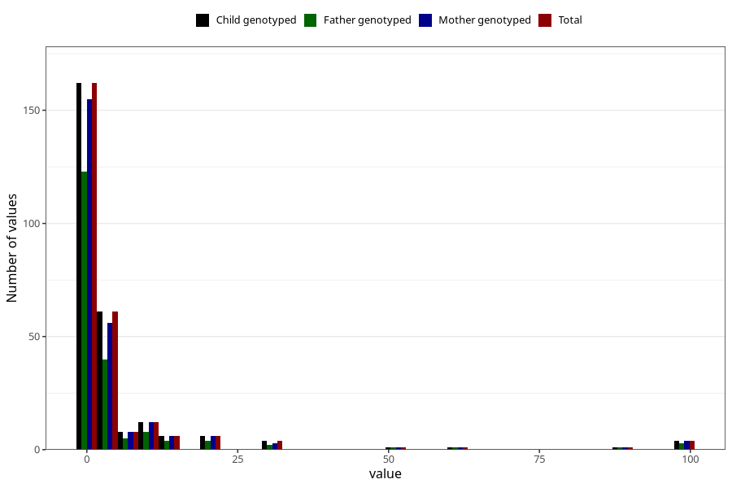

# other_convulsions_with_any_fever_freq_6m
Variable mapping to `DD300` in `Skjema4_6mnd_v12`.
- Number of values:

| Value | Total | Child genotyped | Mother genotyped | Father genotyped |
| ----- | ----- | --------------- | ---------------- | ---------------- |
| Missing | 80739 | 80739 | 76364 | 53412 |
| Non-missing | 266 | 266 | 253 | 192 |
| 25th percentile | 0 | 0 | 0 | 0 |
| 50th percentile | 1 | 1 | 1 | 1 |
| 75th percentile | 3 | 3 | 3 | 3 |
| Mean | 5.06766917293233 | 5.06766917293233 | 5.1501976284585 | 5.13020833333333 |
| Standard deviation | 14.5387941617873 | 14.5387941617873 | 14.8005647267471 | 15.2266892978112 |
| N | 266 | 266 | 253 | 192 |

