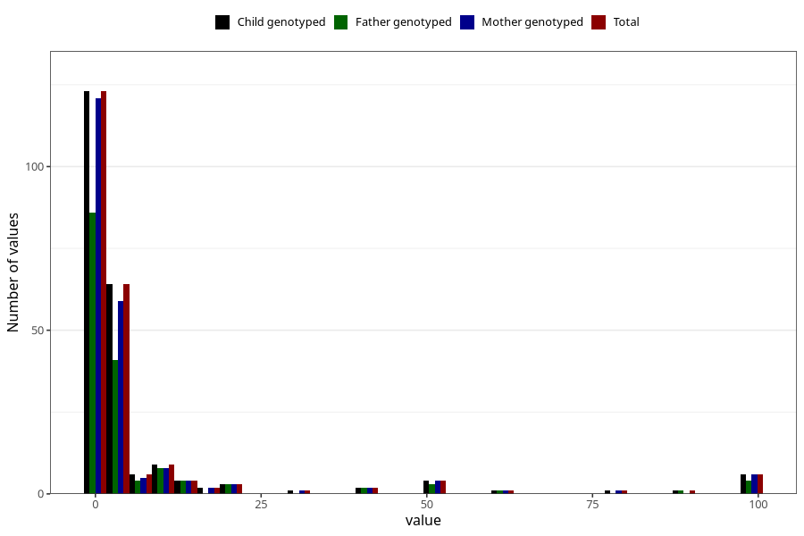

# other_convulsions_without_any_fever_freq_3y
Variable mapping to `GG162` in `Skjema6_3aar_v12`.
- Number of values:

| Value | Total | Child genotyped | Mother genotyped | Father genotyped |
| ----- | ----- | --------------- | ---------------- | ---------------- |
| Missing | 80778 | 80778 | 76400 | 53447 |
| Non-missing | 227 | 227 | 217 | 157 |
| 25th percentile | 1 | 1 | 1 | 1 |
| 50th percentile | 1 | 1 | 1 | 1 |
| 75th percentile | 4 | 4 | 4 | 4 |
| Mean | 7.44933920704846 | 7.44933920704846 | 7.24884792626728 | 7.57324840764331 |
| Standard deviation | 19.1558775149229 | 19.1558775149229 | 18.7397579695997 | 18.9683284686086 |
| N | 227 | 227 | 217 | 157 |

