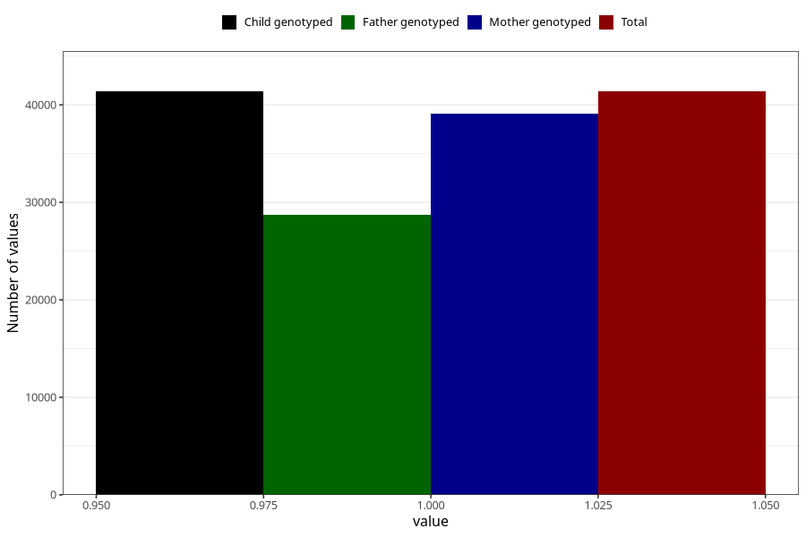

# other_eczema_no_3y
Variable mapping to `GG81` in `Skjema6_3aar_v12`.
- Number of values:

| Value | Total | Child genotyped | Mother genotyped | Father genotyped |
| ----- | ----- | --------------- | ---------------- | ---------------- |
| Missing | 39633 | 39633 | 37492 | 24879 |
| Non-missing | 41372 | 41372 | 39125 | 28725 |
| 1 | 41372 | 41372 | 39125 | 28725 |

