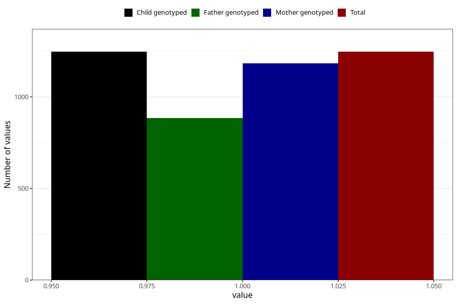

# other_eczema_yes_3y
Variable mapping to `GG82` in `Skjema6_3aar_v12`.
- Number of values:

| Value | Total | Child genotyped | Mother genotyped | Father genotyped |
| ----- | ----- | --------------- | ---------------- | ---------------- |
| Missing | 79759 | 79759 | 75434 | 52719 |
| Non-missing | 1246 | 1246 | 1183 | 885 |
| 1 | 1246 | 1246 | 1183 | 885 |

