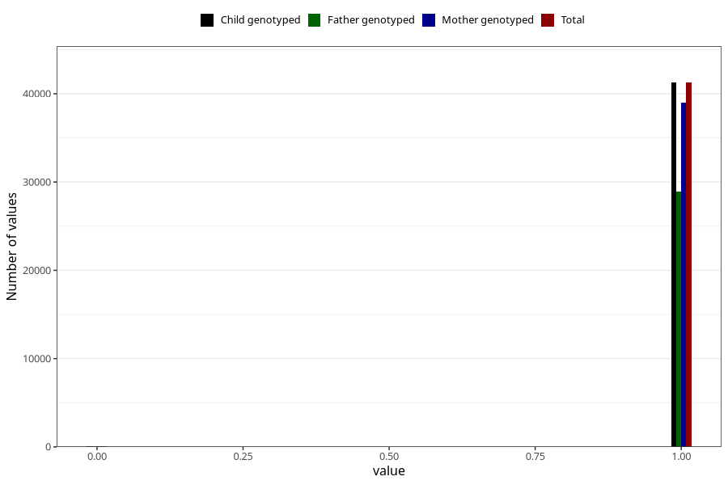

# other_gastrointestinal_problems_2_no_3y
Variable mapping to `GG574` in `Skjema6_3aar_v12`.
- Number of values:

| Value | Total | Child genotyped | Mother genotyped | Father genotyped |
| ----- | ----- | --------------- | ---------------- | ---------------- |
| Missing | 39667 | 39667 | 37533 | 24628 |
| Non-missing | 41338 | 41338 | 39084 | 28976 |
| 0 | 76 | 76 | 72 | 50 |
| 1 | 41262 | 41262 | 39012 | 28926 |

