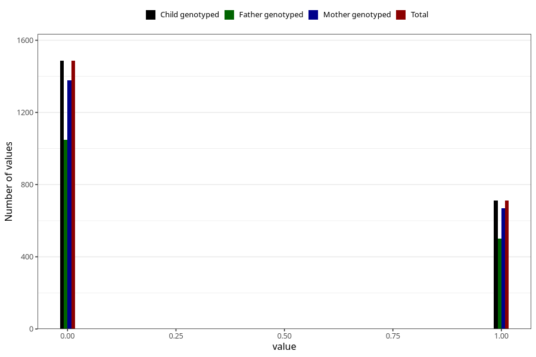

# other_gastrointestinal_problems_2_previous_3y
Variable mapping to `GG576` in `Skjema6_3aar_v12`.
- Number of values:

| Value | Total | Child genotyped | Mother genotyped | Father genotyped |
| ----- | ----- | --------------- | ---------------- | ---------------- |
| Missing | 78807 | 78807 | 74570 | 52055 |
| Non-missing | 2198 | 2198 | 2047 | 1549 |
| 0 | 1486 | 1486 | 1377 | 1048 |
| 1 | 712 | 712 | 670 | 501 |

