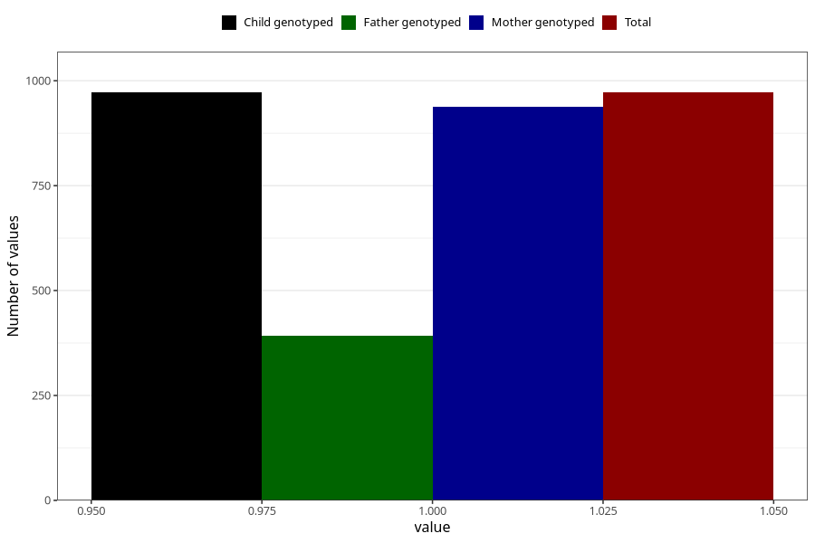

# other_gastrointestinal_problems_no_3y
Variable mapping to `GG89` in `Skjema6_3aar_v12`.
- Number of values:

| Value | Total | Child genotyped | Mother genotyped | Father genotyped |
| ----- | ----- | --------------- | ---------------- | ---------------- |
| Missing | 80033 | 80033 | 75680 | 53212 |
| Non-missing | 972 | 972 | 937 | 392 |
| 1 | 972 | 972 | 937 | 392 |

