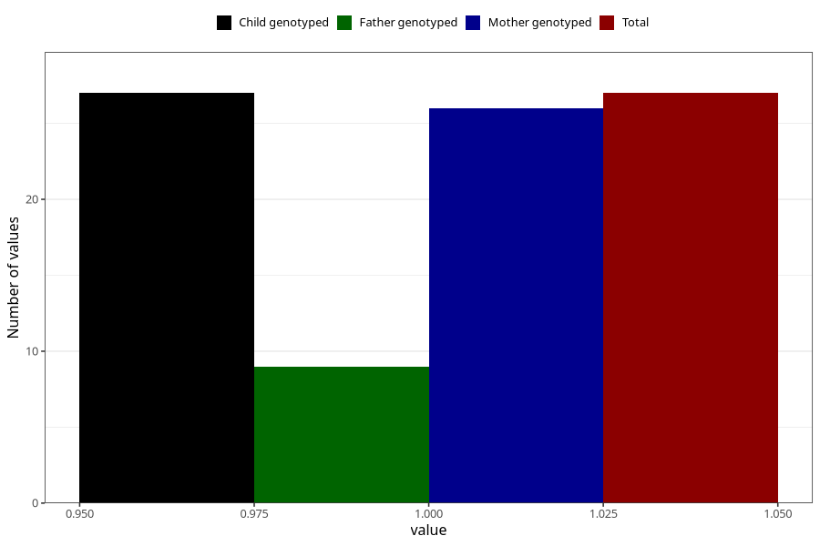

# other_gastrointestinal_problems_yes_3y
Variable mapping to `GG90` in `Skjema6_3aar_v12`.
- Number of values:

| Value | Total | Child genotyped | Mother genotyped | Father genotyped |
| ----- | ----- | --------------- | ---------------- | ---------------- |
| Missing | 80978 | 80978 | 76591 | 53595 |
| Non-missing | 27 | 27 | 26 | 9 |
| 1 | 27 | 27 | 26 | 9 |

