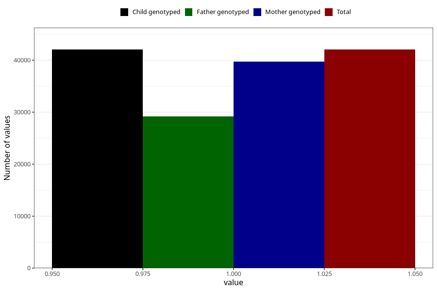

# other_longterm_illness_condition_no_3y
Variable mapping to `GG113` in `Skjema6_3aar_v12`.
- Number of values:

| Value | Total | Child genotyped | Mother genotyped | Father genotyped |
| ----- | ----- | --------------- | ---------------- | ---------------- |
| Missing | 38960 | 38960 | 36846 | 24434 |
| Non-missing | 42045 | 42045 | 39771 | 29170 |
| 1 | 42045 | 42045 | 39771 | 29170 |

