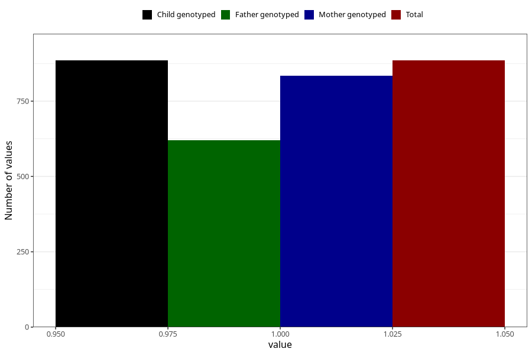

# other_longterm_illness_condition_previous_3y
Variable mapping to `GG115` in `Skjema6_3aar_v12`.
- Number of values:

| Value | Total | Child genotyped | Mother genotyped | Father genotyped |
| ----- | ----- | --------------- | ---------------- | ---------------- |
| Missing | 80120 | 80120 | 75783 | 52984 |
| Non-missing | 885 | 885 | 834 | 620 |
| 1 | 885 | 885 | 834 | 620 |

