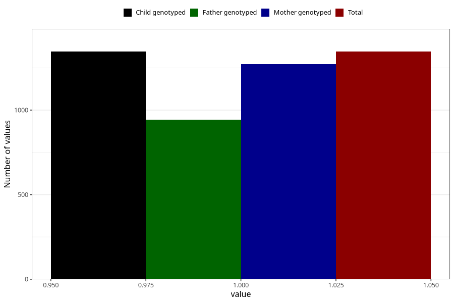

# other_longterm_illness_condition_yes_3y
Variable mapping to `GG114` in `Skjema6_3aar_v12`.
- Number of values:

| Value | Total | Child genotyped | Mother genotyped | Father genotyped |
| ----- | ----- | --------------- | ---------------- | ---------------- |
| Missing | 79659 | 79659 | 75344 | 52662 |
| Non-missing | 1346 | 1346 | 1273 | 942 |
| 1 | 1346 | 1346 | 1273 | 942 |

