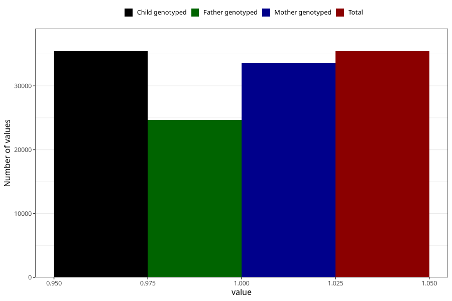

# other_malformations_no_18m
Variable mapping to `EE851` in `Skjema5_18mnd_v12`.
- Number of values:

| Value | Total | Child genotyped | Mother genotyped | Father genotyped |
| ----- | ----- | --------------- | ---------------- | ---------------- |
| Missing | 45578 | 45578 | 43073 | 28901 |
| Non-missing | 35427 | 35427 | 33544 | 24703 |
| 1 | 35427 | 35427 | 33544 | 24703 |

