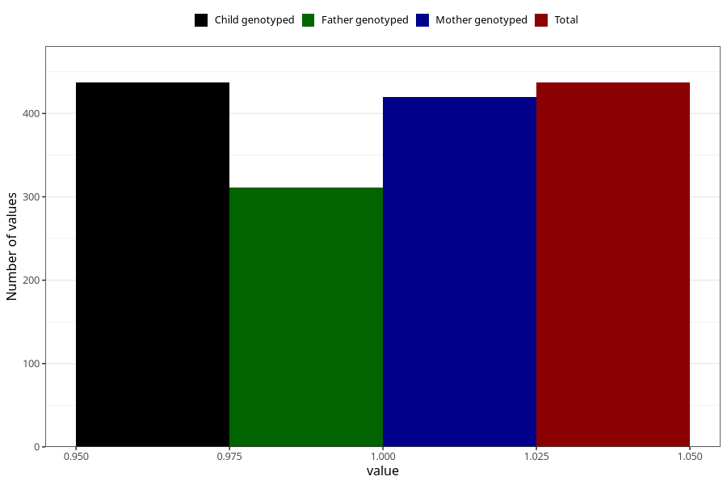

# other_malformations_previously_18m
Variable mapping to `EE853` in `Skjema5_18mnd_v12`.
- Number of values:

| Value | Total | Child genotyped | Mother genotyped | Father genotyped |
| ----- | ----- | --------------- | ---------------- | ---------------- |
| Missing | 80568 | 80568 | 76197 | 53293 |
| Non-missing | 437 | 437 | 420 | 311 |
| 1 | 437 | 437 | 420 | 311 |

