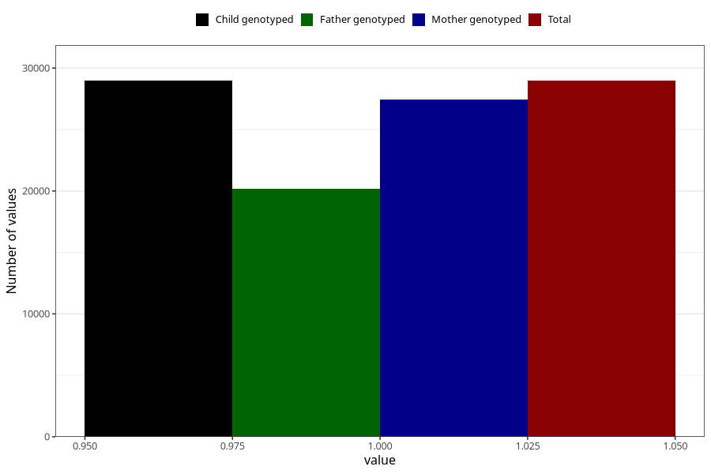

# other_no_18m
Variable mapping to `EE856` in `Skjema5_18mnd_v12`.
- Number of values:

| Value | Total | Child genotyped | Mother genotyped | Father genotyped |
| ----- | ----- | --------------- | ---------------- | ---------------- |
| Missing | 52034 | 52034 | 49198 | 33402 |
| Non-missing | 28971 | 28971 | 27419 | 20202 |
| 1 | 28971 | 28971 | 27419 | 20202 |

