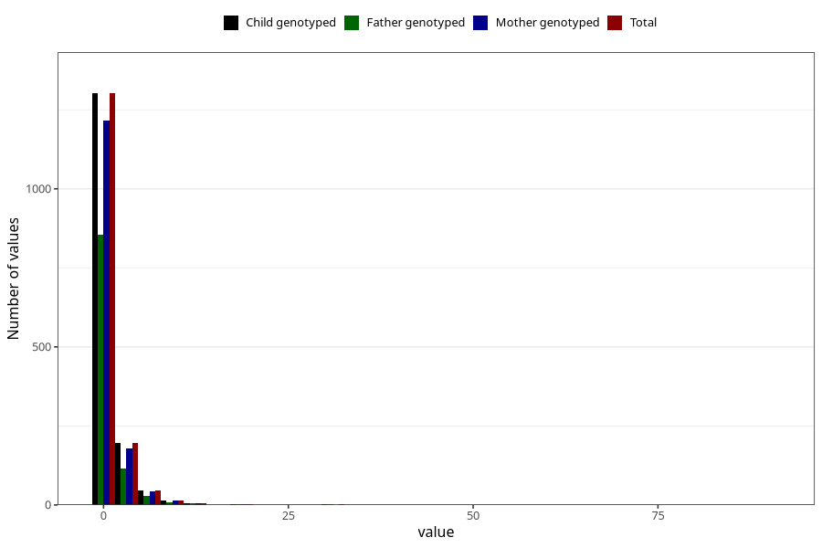

# other_number_6_11m
Variable mapping to `EE271` in `Skjema5_18mnd_v12`.
- Number of values:

| Value | Total | Child genotyped | Mother genotyped | Father genotyped |
| ----- | ----- | --------------- | ---------------- | ---------------- |
| Missing | 79429 | 79429 | 75147 | 52580 |
| Non-missing | 1576 | 1576 | 1470 | 1024 |
| Filled in text or mark instead of number | 4 | 4 | 4 |4 |
| 0 | 127 | 127 | 117 | 85 |
| 1 | 1175 | 1175 | 1100 | 771 |
| 2 | 117 | 117 | 111 | 67 |
| 3 | 54 | 54 | 50 | 32 |
| 4 | 24 | 24 | 18 | 16 |
| 5 | 21 | 21 | 20 | 16 |
| 6 | 15 | 15 | 13 | 9 |
| 7 | 10 | 10 | 9 | 4 |
| 8 | 4 | 4 | 4 | 3 |
| 10 | 9 | 9 | 9 | 6 |
| 11 | 3 | 3 | 3 | 3 |
| 12 | 3 | 3 | 3 | 1 |
| 15 | 1 | 1 | 1 | 1 |
| 20 | 3 | 3 | 3 | 2 |
| 25 | 1 | 1 | 1 | 1 |
| 30 | 2 | 2 | 1 | 2 |
| 40 | 1 | 1 | 1 | 0 |
| 50 | 1 | 1 | 1 | 1 |
| 90 | 1 | 1 | 1 | 0 |

