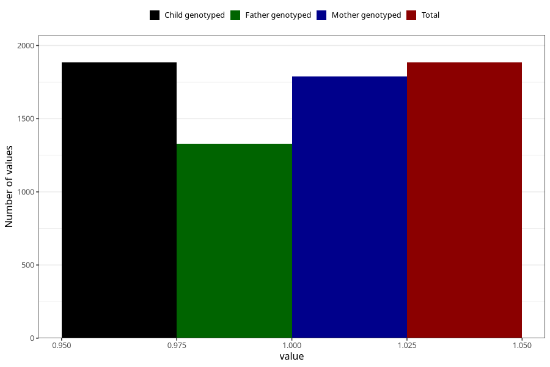

# other_previously_18m
Variable mapping to `EE858` in `Skjema5_18mnd_v12`.
- Number of values:

| Value | Total | Child genotyped | Mother genotyped | Father genotyped |
| ----- | ----- | --------------- | ---------------- | ---------------- |
| Missing | 79121 | 79121 | 74828 | 52274 |
| Non-missing | 1884 | 1884 | 1789 | 1330 |
| 1 | 1884 | 1884 | 1789 | 1330 |

