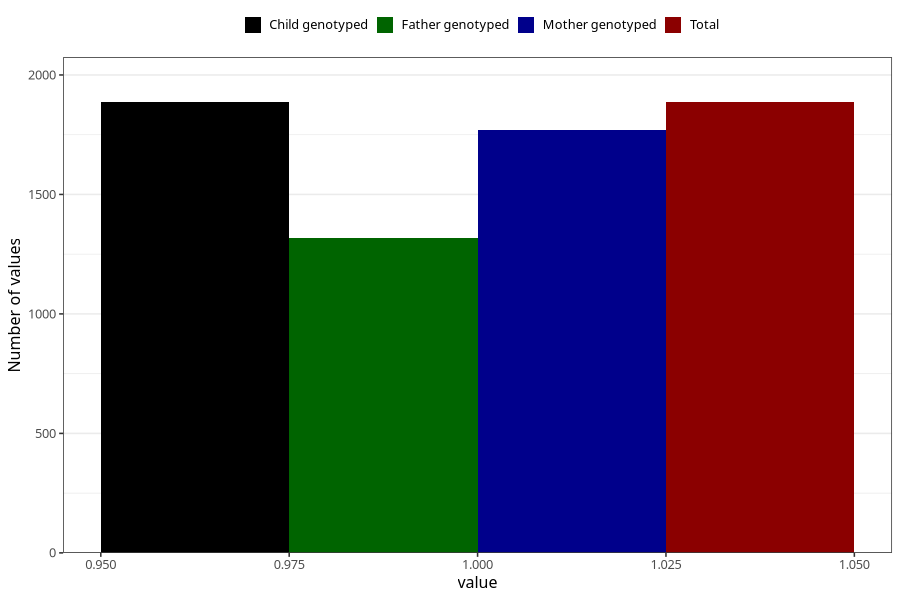

# other_yes_18m
Variable mapping to `EE857` in `Skjema5_18mnd_v12`.
- Number of values:

| Value | Total | Child genotyped | Mother genotyped | Father genotyped |
| ----- | ----- | --------------- | ---------------- | ---------------- |
| Missing | 79119 | 79119 | 74848 | 52288 |
| Non-missing | 1886 | 1886 | 1769 | 1316 |
| 1 | 1886 | 1886 | 1769 | 1316 |

