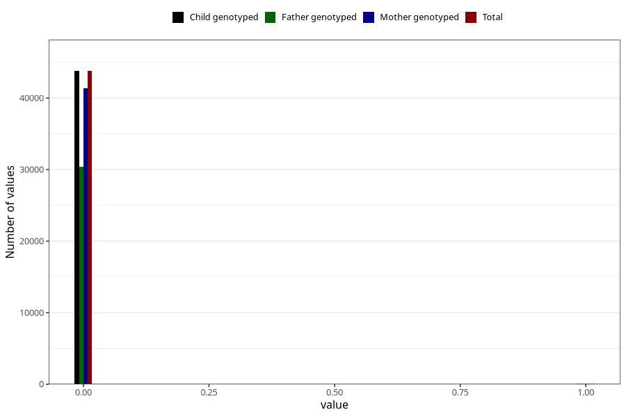

# overweight_3y
Variable created during phenotype curation.
- Number of values:

| Value | Total | Child genotyped | Mother genotyped | Father genotyped |
| ----- | ----- | --------------- | ---------------- | ---------------- |
| Missing | 37117 | 37117 | 35105 | 23111 |
| Non-missing | 43888 | 43888 | 41512 | 30493 |
| 0 | 43771 | 43771 | 41402 | 30408 |
| 1 | 117 | 117 | 110 | 85 |

