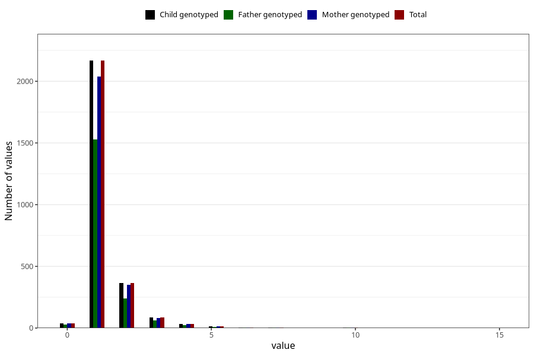

# pneumonia_freq_3y
Variable mapping to `GG147` in `Skjema6_3aar_v12`.
- Number of values:

| Value | Total | Child genotyped | Mother genotyped | Father genotyped |
| ----- | ----- | --------------- | ---------------- | ---------------- |
| Missing | 78285 | 78285 | 74052 | 51707 |
| Non-missing | 2720 | 2720 | 2565 | 1897 |
| 0 | 38 | 38 | 37 | 26 |
| 1 | 2167 | 2167 | 2037 | 1527 |
| 2 | 365 | 365 | 348 | 240 |
| 3 | 86 | 86 | 81 | 62 |
| 4 | 34 | 34 | 33 | 22 |
| 5 | 14 | 14 | 13 | 8 |
| 6 | 5 | 5 | 5 | 4 |
| 7 | 4 | 4 | 4 | 3 |
| 9 | 1 | 1 | 1 | 0 |
| 10 | 3 | 3 | 3 | 3 |
| 11 | 1 | 1 | 1 | 1 |
| 12 | 1 | 1 | 1 | 0 |
| 15 | 1 | 1 | 1 | 1 |

