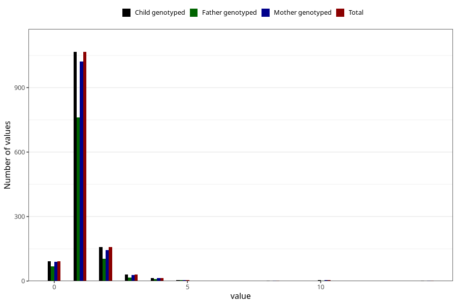

# pseudocroup_freq_6m
Variable mapping to `DD276` in `Skjema4_6mnd_v12`.
- Number of values:

| Value | Total | Child genotyped | Mother genotyped | Father genotyped |
| ----- | ----- | --------------- | ---------------- | ---------------- |
| Missing | 79634 | 79634 | 75310 | 52637 |
| Non-missing | 1371 | 1371 | 1307 | 967 |
| 0 | 93 | 93 | 89 | 69 |
| 1 | 1066 | 1066 | 1022 | 761 |
| 2 | 158 | 158 | 145 | 103 |
| 3 | 30 | 30 | 27 | 17 |
| 4 | 13 | 13 | 13 | 10 |
| 5 | 5 | 5 | 5 | 5 |
| 8 | 1 | 1 | 1 | 0 |
| 10 | 4 | 4 | 4 | 2 |
| 14 | 1 | 1 | 1 | 0 |

