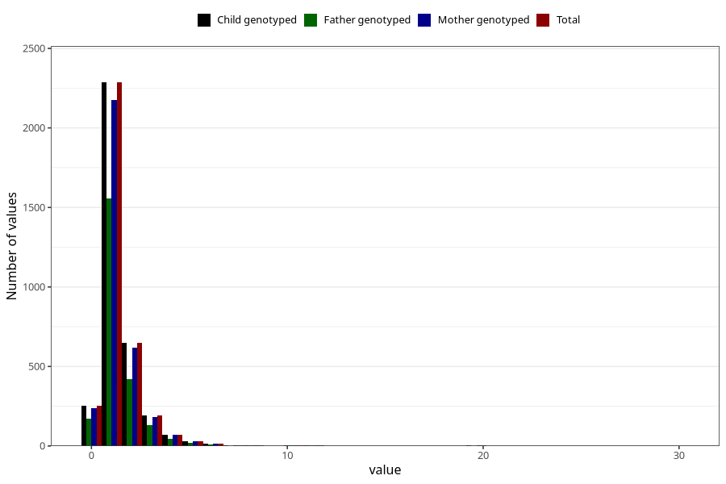

# pseudocroup_number_6_11m
Variable mapping to `EE231` in `Skjema5_18mnd_v12`.
- Number of values:

| Value | Total | Child genotyped | Mother genotyped | Father genotyped |
| ----- | ----- | --------------- | ---------------- | ---------------- |
| Missing | 77486 | 77486 | 73270 | 51233 |
| Non-missing | 3519 | 3519 | 3347 | 2371 |
| 0 | 253 | 253 | 240 | 171 |
| 1 | 2286 | 2286 | 2174 | 1557 |
| 2 | 648 | 648 | 618 | 422 |
| 3 | 191 | 191 | 181 | 130 |
| 4 | 72 | 72 | 70 | 47 |
| 5 | 31 | 31 | 30 | 21 |
| 6 | 17 | 17 | 15 | 10 |
| 7 | 3 | 3 | 3 | 1 |
| 8 | 5 | 5 | 4 | 4 |
| 9 | 1 | 1 | 1 | 1 |
| 10 | 6 | 6 | 5 | 4 |
| 11 | 3 | 3 | 3 | 2 |
| 20 | 2 | 2 | 2 | 1 |
| 30 | 1 | 1 | 1 | 0 |

