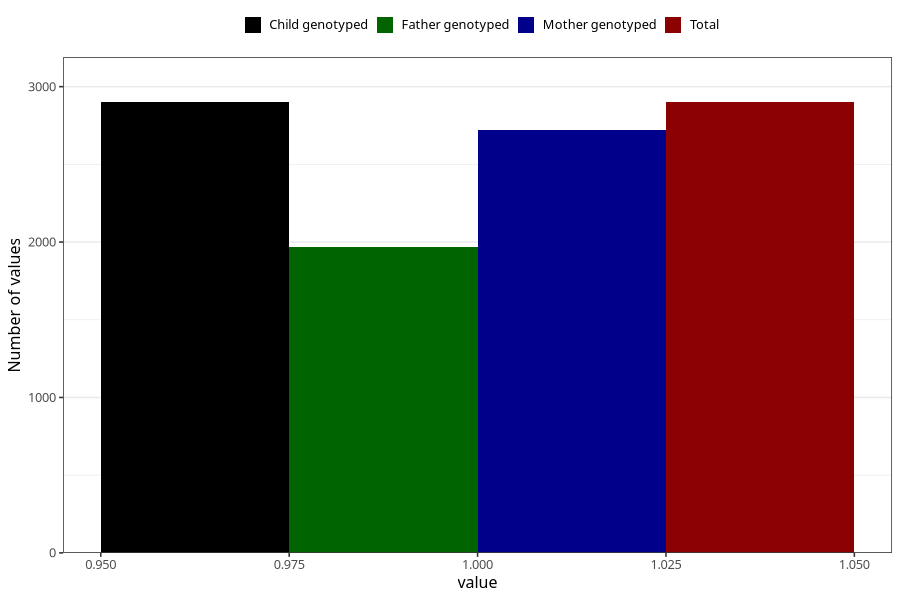

# removed_tonsils_7y
Variable mapping to `JJ439` in `Skjema7aar_v12`.
- Number of values:

| Value | Total | Child genotyped | Mother genotyped | Father genotyped |
| ----- | ----- | --------------- | ---------------- | ---------------- |
| Missing | 78105 | 78105 | 73894 | 51635 |
| Non-missing | 2900 | 2900 | 2723 | 1969 |
| 1 | 2900 | 2900 | 2723 | 1969 |

