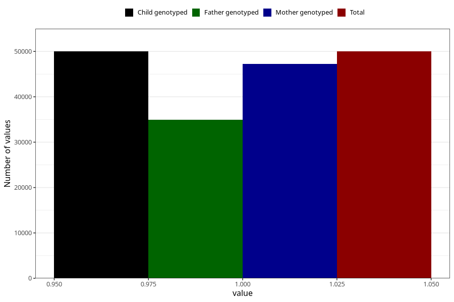

# sleep_problems_no_18m
Variable mapping to `EE843` in `Skjema5_18mnd_v12`.
- Number of values:

| Value | Total | Child genotyped | Mother genotyped | Father genotyped |
| ----- | ----- | --------------- | ---------------- | ---------------- |
| Missing | 31005 | 31005 | 29314 | 18646 |
| Non-missing | 50000 | 50000 | 47303 | 34958 |
| 1 | 50000 | 50000 | 47303 | 34958 |

