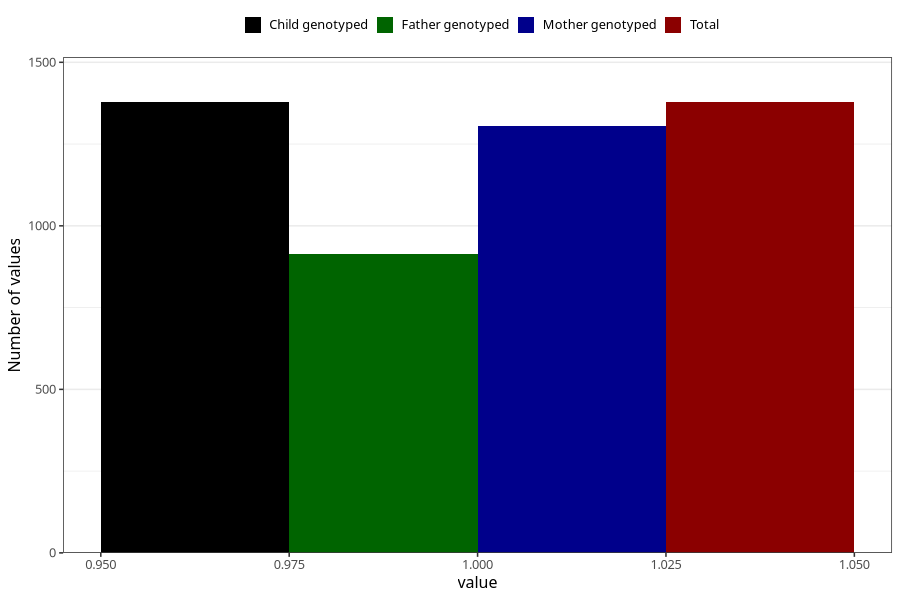

# sleep_problems_previous_3y
Variable mapping to `GG99` in `Skjema6_3aar_v12`.
- Number of values:

| Value | Total | Child genotyped | Mother genotyped | Father genotyped |
| ----- | ----- | --------------- | ---------------- | ---------------- |
| Missing | 79627 | 79627 | 75312 | 52689 |
| Non-missing | 1378 | 1378 | 1305 | 915 |
| 1 | 1378 | 1378 | 1305 | 915 |

