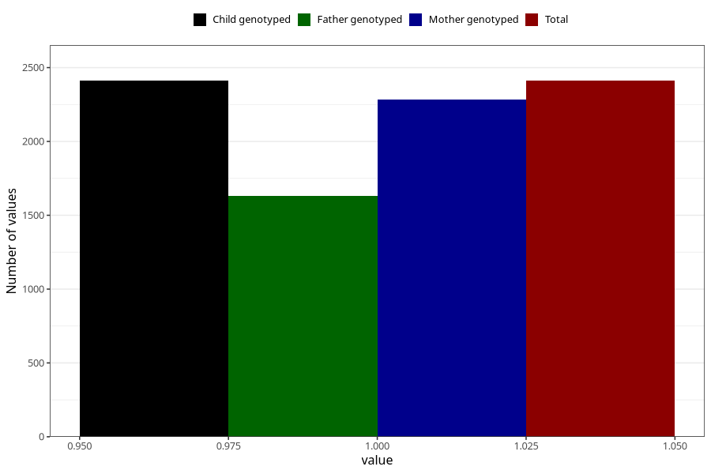

# sleep_problems_previously_18m
Variable mapping to `EE845` in `Skjema5_18mnd_v12`.
- Number of values:

| Value | Total | Child genotyped | Mother genotyped | Father genotyped |
| ----- | ----- | --------------- | ---------------- | ---------------- |
| Missing | 78594 | 78594 | 74335 | 51973 |
| Non-missing | 2411 | 2411 | 2282 | 1631 |
| 1 | 2411 | 2411 | 2282 | 1631 |

