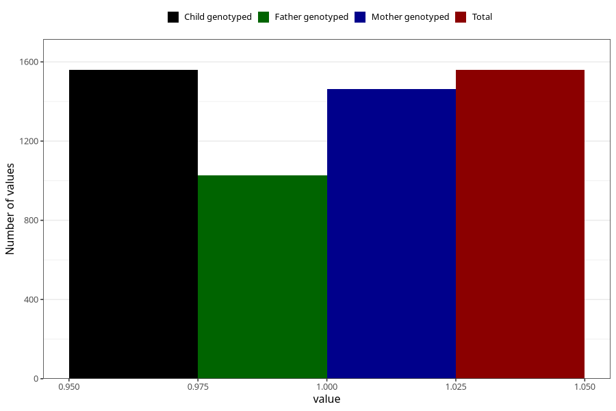

# sleep_problems_yes_18m
Variable mapping to `EE844` in `Skjema5_18mnd_v12`.
- Number of values:

| Value | Total | Child genotyped | Mother genotyped | Father genotyped |
| ----- | ----- | --------------- | ---------------- | ---------------- |
| Missing | 79446 | 79446 | 75153 | 52576 |
| Non-missing | 1559 | 1559 | 1464 | 1028 |
| 1 | 1559 | 1559 | 1464 | 1028 |

